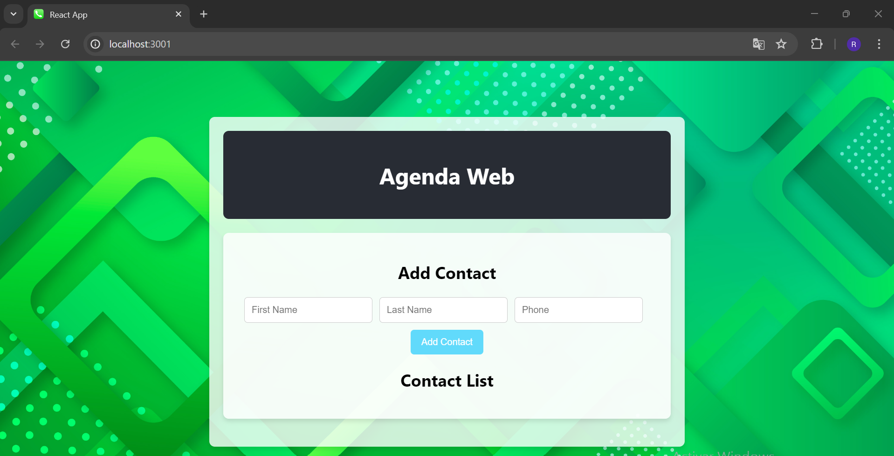

Esta es mi tarea 4 de programacion wed, mi nombre Rusbert Junior Carpio Rosario, No. Matricula: 2023-0682,
aqui le dejo imagenes de la agenda de contactos utilizando React y componentes para generar tanto la lista de contactos
como el formulario para agregarlo

,

OJO(dentro del directorio raiz de mi proyecto, en la carpeta "src", estan los 3 captures por si no le salen en el
archivo readme).

